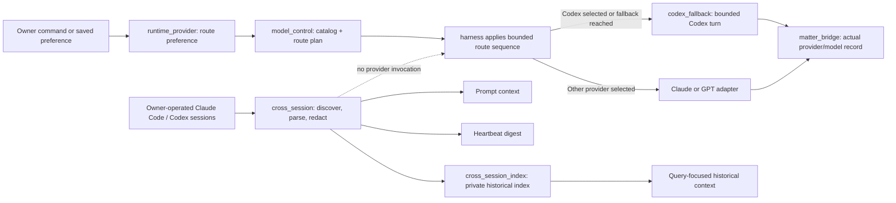

# Jarvis Architecture Decisions

This file records current decisions that are easy to blur when several Agents
work in the same area. It is current-state knowledge, not a history of every
implementation discussion. Product history remains in `docs/prd_portfolio.md`;
runtime topology and domain boundaries remain in `ARCHITECTURE.md`.

## ADR-001: Runtime Choice, Codex Execution, and Cross-Session Context

**Status:** accepted
**Decision:** executor choice, executor implementation, and external-session
continuity are three different responsibilities.

| Module | Owns | Must not own |
|---|---|---|
| `core.runtime_provider` | The owner's durable per-conversation preferred executor (`auto` or `codex`). | Defining route capabilities/order, recording which provider answered, starting a model process, or reading provider transcripts. |
| `core.model_control` | The sanitized model catalog, private harness environment, route order, trust/tool policy, health cooldown application, and upstream-diversity truth. | Starting a model process, parsing provider output, storing conversation preference, or treating model prose as a receipt. |
| `core.codex_fallback` | One bounded, owner-private Codex CLI execution; process control; and one durable Codex thread per Lark conversation. | Provider preference, group/untrusted traffic, or cross-session discovery and projection. |
| `core.cross_session` | Bounded discovery, parsing, redaction, recent projection, and incremental digest of owner-operated Claude Code/Codex sessions. | Selecting or invoking a provider, claiming that an external session completed work, or replacing provider transcripts as source of truth. |
| `core.cross_session_index` | A private, rebuildable SQLite index of redacted owner-operated session turns and query-focused historical projection. | Copying tool payloads, entering groups/Matters, or becoming authority for mutable facts. |
| `core.matter_bridge` | The provider-neutral Lark conversation-turn ledger and the actual provider/model/session record after a successful answer. | Choosing a provider, invoking a model, or scraping external coding sessions. |

The short version is:

```text
runtime_provider stores the owner's route preference
model_control turns config + health + context into an eligible route plan
codex_fallback executes one allowed Codex turn
cross_session observes recent external interactive context
cross_session_index retrieves relevant older external context
matter_bridge records the route that actually answered
```

### Control Flow



### Change Routing

- Change “prefer Codex / prefer Claude” persistence in `core.runtime_provider`.
- Change route definitions, order, capability/trust policy, cooldown
  application, upstream diversity, or `/model` route truth in
  `core.model_control`.
- Change Codex CLI arguments, timeout/process behavior, sandboxing, or durable
  Lark-to-Codex thread reuse in `core.codex_fallback`.
- Change which external sessions are found, excluded, redacted, parsed, or
  projected in `core.cross_session`.
- Change historical indexing, retention, or query ranking in
  `core.cross_session_index`.
- A model response is never completion evidence. Cross-session context may
  help reconstruct intent, but authoritative receipts and domain state still
  decide whether work finished.

### Dependency Rule

`model_control` must not call an execution adapter. `cross_session` and
`cross_session_index` must not call `codex_fallback`, and `codex_fallback` must
not consult cross-session projections to decide whether to run. A harness may
apply the route plan, call an adapter, and record the actual result through
`matter_bridge`, but execution, continuity, and the conversation ledger must
not create a second preference or route-policy store.

## Architecture Adjacency Check

Use the stdlib-only graph check before and after a broad self-improve round:

```bash
python3 scripts/import_graph.py core --threshold 20
python3 scripts/import_graph.py core --format mermaid --focus core.cross_session
python3 scripts/import_graph.py core --max-direct-cycles 11
```

The first command ranks modules by unique adjacent internal modules and warns
when a module exceeds the chosen review threshold. The second emits a Mermaid
one-hop view suitable for a PR or architecture note. A threshold is a review
trigger, not proof that a module is badly designed; central authority modules
can have intentionally high fan-in. CI can opt into a hard gate with
`--fail-on-threshold` once a reviewed baseline exists. Direct two-module
cycles are different: pytest enforces the reviewed current baseline and fails
on any new pair, while removals need no allowlist change.

## ADR-002: Memorial Boundaries and Failure Evidence

**Status:** accepted

- `core.memorial_ledger` owns append/fold storage primitives.
- `core.memorial_cards` owns card parsing and composition.
- `core.memorial_transport` owns the low-level Lark send attempt and emits
  structured, payload-free failure evidence.
- `core.memorial_contracts` owns shared state values imported by readers.
- `core.memorial` remains the compatibility facade and orchestration layer.

Delivery truth is still `core.delivery` plus SQLite receipts/dead letters.
Structured log events make failure diagnosable; they never substitute for a
receipt and must not contain private card bodies or provider stderr.

The current delivery retry and cap decision is documented, with its state
machine, in `docs/delivery_retry_and_caps.md`.

## ADR-003: Lark Bot Transport Is Independent of User OAuth

**Status:** accepted

- `core.lark_bot_transport` owns application-bot authentication and the direct
  OpenAPI send/get-info calls. It reads the private app credential at runtime,
  keeps the tenant token only in memory, and requires a returned Lark
  `message_id` before reporting success.
- `core.delivery` remains the authority for retries, deduplication, attention,
  quiet hours, and terminal delivery state. A transport receipt is evidence
  for one attempt, not a second delivery state machine.
- `lark-cli --as user` remains the adapter for owner-identity calendar, docs,
  mail, task, and other personal APIs. A user OAuth/Keychain failure may
  degrade those capabilities, but must not disable bot replies, cards,
  proactive alerts, EigenFlux messages, or bot identity discovery.
- The old bot-only `lark-cli` send path is a compatibility fallback when an
  installation has no app secret. It is not the preferred production path.

Never copy the app secret or tenant token into delivery rows, logs, test
fixtures, command arguments, or Git. Bot API errors are recorded as bounded
reason codes; only a real provider receipt can advance delivery to delivered.

## ADR-004: Product Expansion Is Frozen Around Lark

**Status:** accepted (2026-08-17)

- Lark is the sole user-facing delivery and decision surface.
- Admin `:3456` is an operator console. Dashboard `:3457` is a frozen archive
  and operations reference. Mobile gateway `:3458`, device pairing, Web Push,
  and every Jarvis-owned Tailscale path are retired.
- Existing Routines remain active and deliver through ordinary Lark Items.
  Their product surface and authority model are frozen; reliability repairs do
  not require a product thaw.
- The freeze blocks new surfaces, inboxes, notification lanes, and autonomous
  authority. It does not block security, privacy, tests, observability,
  documentation, incident repair, or behavior-preserving module extraction.

Historical PRDs do not reopen retired scope. A thaw requires an explicit owner
decision, a named human outcome, retirement of equivalent complexity, and
updated product/authority/privacy contracts before implementation.

## ADR-005: Provider Replay Safety And Routine Deferral

**Status:** accepted (2026-08-17)

- Model policy belongs to `core.model_control`; harness adapters execute calls.
  A provider route is not a new product surface.
- Text-only/no-tools calls may fail over after bounded network, timeout,
  server, quota, authentication, or model-availability failures.
- A tool-capable call may have changed local state before timing out. Unknown,
  post-tool, and transport-ambiguous failures therefore stop fail-closed; they
  are not replayed automatically through another provider.
- Routine occurrences are claimed before the model call. Infrastructure
  failure closes the run as `deferred` and re-arms the Routine after a short
  bounded delay. A model answer with no usable Routine content closes as
  `no_output`. These states must never be collapsed.
- The scheduler owns deferred recovery. User notification is reserved for
  exhausted recovery or a genuine owner action, not the first internal retry.

This decision prevents two opposite failures: silently spending a reminder
because a provider was unavailable, and duplicating local effects by replaying
an uncertain agentic call.
