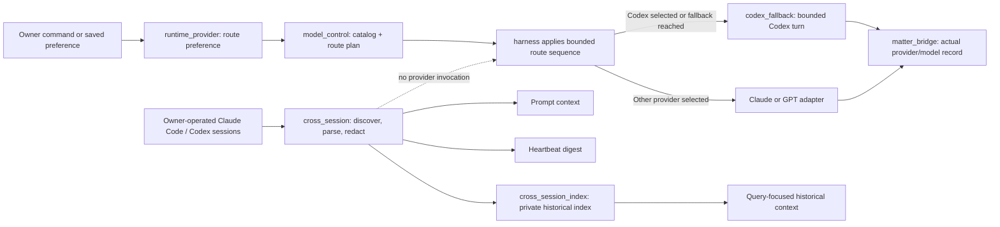

# Jarvis Architecture Decisions

This file records current decisions that are easy to blur when several Agents
work in the same area. It is current-state knowledge, not a history of every
implementation discussion. Product history remains in `docs/prd_portfolio.md`;
runtime topology and domain boundaries remain in `ARCHITECTURE.md`.

## ADR-001: Runtime Choice, Codex Execution, and Cross-Session Context

**Status:** accepted
**Decision:** executor choice, executor implementation, and external-session
continuity are three different responsibilities.

| Module | Owns | Must not own |
|---|---|---|
| `core.runtime_provider` | The owner's durable per-conversation preferred executor (`auto` or `codex`). | Defining route capabilities/order, recording which provider answered, starting a model process, or reading provider transcripts. |
| `core.model_control` | The sanitized model catalog, private harness environment, route order, trust/tool policy, health cooldown application, and upstream-diversity truth. | Starting a model process, parsing provider output, storing conversation preference, or treating model prose as a receipt. |
| `core.codex_fallback` | One bounded, owner-private Codex CLI execution; process control; and one durable Codex thread per logical Matter context. | Provider preference, group/untrusted traffic, or cross-session discovery and projection. |
| `core.cross_session` | Bounded discovery, parsing, redaction, recent projection, and incremental digest of owner-operated Claude Code/Codex sessions. | Selecting or invoking a provider, claiming that an external session completed work, or replacing provider transcripts as source of truth. |
| `core.cross_session_index` | A private, rebuildable SQLite index of redacted owner-operated session turns and query-focused historical projection. | Copying tool payloads, entering groups/Matters, or becoming authority for mutable facts. |
| `core.matter_bridge` | The provider-neutral conversation-turn ledger and the actual provider/model/session record after a successful answer. | Choosing a provider, invoking a model, or scraping external coding sessions. |

The short version is:

```text
runtime_provider stores the owner's route preference
model_control turns config + health + context into an eligible route plan
codex_fallback executes one allowed Codex turn
cross_session observes recent external interactive context
cross_session_index retrieves relevant older external context
matter_bridge records the route that actually answered
```

### Control Flow



### Change Routing

- Change “prefer Codex / prefer Claude” persistence in `core.runtime_provider`.
- Change route definitions, order, capability/trust policy, cooldown
  application, upstream diversity, or `/model` route truth in
  `core.model_control`.
- Change Codex CLI arguments, timeout/process behavior, sandboxing, or durable
  Matter-to-Codex thread reuse in `core.codex_fallback`.
- Change which external sessions are found, excluded, redacted, parsed, or
  projected in `core.cross_session`.
- Change historical indexing, retention, or query ranking in
  `core.cross_session_index`.
- A model response is never completion evidence. Cross-session context may
  help reconstruct intent, but authoritative receipts and domain state still
  decide whether work finished.

### Dependency Rule

`model_control` must not call an execution adapter. `cross_session` and
`cross_session_index` must not call `codex_fallback`, and `codex_fallback` must
not consult cross-session projections to decide whether to run. A harness may
apply the route plan, call an adapter, and record the actual result through
`matter_bridge`, but execution, continuity, and the conversation ledger must
not create a second preference or route-policy store.

## ADR-006: Codex Owns The Frontstage; Jarvis Integrates Through MCP

**Status:** accepted

- Codex owns interactive tasks, desktop/mobile Remote, tools, approvals,
  diffs, long output, and ordinary task-local memory.
- Jarvis exposes only application-owned capabilities through a local stdio MCP
  server: durable Matter discovery, bounded Context Packets, run leases,
  verified Result Receipts, and protocol health.
- The MCP adapter calls `core.codex_frontstage`; it does not implement a second
  Matter state machine. Claude Code or another harness may reuse that Python
  contract without MCP.
- The connector does not scrape or mutate undocumented Codex task storage.
  Codex app-server is reserved for a future host-driven journey that truly
  needs programmatic task creation/resumption and streamed approvals.
- Jarvis cannot grant an executor Matter-completion authority or accept model
  prose as external-effect evidence. Release closes the run only.
- Desktop/mobile migration evidence is written through the operator CLI, not
  an MCP write tool. A model may expose the report but cannot review itself.
- A repo-owned Codex plugin supplies concise routing guidance and starts the
  local MCP process. Its installation records only the local repository path;
  secrets and private Matter data stay in the existing private Jarvis store.

The full product journey and replacement rules are in
`docs/codex_jarvis_user_journey.md`.

## Architecture Adjacency Check

Use the stdlib-only graph check before and after a broad self-improve round:

```bash
python3 scripts/import_graph.py core --threshold 20
python3 scripts/import_graph.py core --format mermaid --focus core.cross_session
python3 scripts/import_graph.py core --max-direct-cycles 11
```

The first command ranks modules by unique adjacent internal modules and warns
when a module exceeds the chosen review threshold. The second emits a Mermaid
one-hop view suitable for a PR or architecture note. A threshold is a review
trigger, not proof that a module is badly designed; central authority modules
can have intentionally high fan-in. CI can opt into a hard gate with
`--fail-on-threshold` once a reviewed baseline exists. Direct two-module
cycles are different: pytest enforces the reviewed current baseline and fails
on any new pair, while removals need no allowlist change.

## ADR-002: Memorial Boundaries and Failure Evidence

**Status:** accepted

- `core.memorial_ledger` owns append/fold storage primitives.
- `core.memorial_cards` owns card parsing and composition.
- `core.memorial_transport` owns the low-level Lark send attempt and emits
  structured, payload-free failure evidence.
- `core.memorial_contracts` owns shared state values imported by readers.
- `core.memorial` remains the compatibility facade and orchestration layer.

Delivery truth is still `core.delivery` plus SQLite receipts/dead letters.
Structured log events make failure diagnosable; they never substitute for a
receipt and must not contain private card bodies or provider stderr.

The current delivery retry and cap decision is documented, with its state
machine, in `docs/delivery_retry_and_caps.md`.

## ADR-003: Lark Bot Transport Is Independent of User OAuth

**Status:** accepted

- `core.lark_bot_transport` owns application-bot authentication and the direct
  OpenAPI send/get-info calls. It reads the private app credential at runtime,
  keeps the tenant token only in memory, and requires a returned Lark
  `message_id` before reporting success.
- `core.delivery` remains the authority for retries, deduplication, attention,
  quiet hours, and terminal delivery state. A transport receipt is evidence
  for one attempt, not a second delivery state machine.
- `lark-cli --as user` remains the adapter for owner-identity calendar, docs,
  mail, task, and other personal APIs. A user OAuth/Keychain failure may
  degrade those capabilities, but must not disable bot replies, cards,
  proactive alerts, EigenFlux messages, or bot identity discovery.
- The old bot-only `lark-cli` send path is a compatibility fallback when an
  installation has no app secret. It is not the preferred production path.

Never copy the app secret or tenant token into delivery rows, logs, test
fixtures, command arguments, or Git. Bot API errors are recorded as bounded
reason codes; only a real provider receipt can advance delivery to delivered.

## ADR-004: Heartbeat Task Model And Context Policy

**Status:** accepted

- Product/task policy declares `model: opus|sonnet|haiku|gpt` in
  `HEARTBEAT.md`; the execution harness validates it and records the provider
  and model that actually answered.
- GPT is an isolated provider route. Compatible Claude tasks may batch and use
  the strongest declared Claude tier in that batch. A requested lower tier is
  preserved through relay failover rather than silently becoming Opus.
- Untrusted tasks have no tools and no personal memory. They may receive only
  the sanitized `triage_profile` configuration. Outbound work removes private
  inbox buffers and runs separately from inbound work.
- One logical call owns one wall-clock budget. A production prompt is never a
  health probe; `provider-canary` owns small recovery probes. Tool-capable
  timeouts are not replayed because side effects may already have occurred.
- Model assignment is changed by reviewed task policy and live quality/cost
  evidence, not by an autonomous runtime quality downgrade.

## ADR-005: Maintenance Gates And Runtime Retention

**Status:** accepted

- Expensive periodic work may use a digest-only change gate plus one daily
  staleness pass. Candidate memory or publication prose is never persisted in
  gate state.
- Retention deletes only old operational detail from an allowlist. Source
  envelopes, user-visible rows, open audit issues, and lifecycle receipts are
  preserved. Active runtimes use `PRAGMA optimize`; VACUUM is an offline
  maintenance operation, not a daemon task.
- Runtime permission repair is allowlisted to private state directories/files
  and skips symlinks. Temporary cleanup removes only old Jarvis-owned audit or
  retired-Tailscale artifacts.
- A removed heartbeat surface is recorded in capability inventory retirement
  evidence. Default-disabled code with no production consumer is not counted
  as an active product feature.

## ADR-006: Provider Cache Boundaries Use Exact System Snapshots

**Status:** accepted

Provider prompt caching hashes complete content blocks. A changing timestamp,
calendar row, or memory file at the end of one system text block still changes
the block; ordering stable text before it is insufficient.

- Lark conversations keep one mode-0600 system snapshot per provider session.
  A new session, Matter, trust boundary, provider memory budget, reviewed
  runtime revision, or prompt-code digest receives a different snapshot.
- Heartbeat keeps an in-process one-hour snapshot per trust/tool profile on the
  primary Claude path. Full-memory editors, outbound contexts, and fallback
  providers rebuild instead of receiving a stale incompatible snapshot.
- Current time and live task DATA belong in the user request. The Lark handler
  already prefixes every incoming turn with an authoritative local timestamp.
- Snapshot files contain private memory, remain under ignored runtime `data/`,
  are created with directory mode 0700/file mode 0600, refresh after one hour
  so cross-session memory cannot freeze for days, and are bounded to 128. A
  single mode-0600 directory lock bounds lock state. The lock protects cache
  reads, pruning, and atomic publication, but never memory/transcript assembly;
  a second read before publication preserves the first complete snapshot when
  two workers miss the same key concurrently.
- Provider secrets are scoped to execution adapters. They are never globally
  exported to admin, network sidecars, deterministic task scripts, another
  provider's process, or a Jarvis-controlled Codex/GPT tool subprocess.

This is a latency and cost optimization, never a completion receipt. Current
facts still come from deterministic task DATA or a synchronous tool check.

## ADR-007: Codex Is Frontstage; Jarvis Is the Continuity and Control Plane

**Status:** accepted; Phase-1 protocol implemented in repository, production
migration gated by review/release and real desktop/mobile evidence

The primary interactive product will be Codex on desktop and mobile. Jarvis is
the backstage continuity and control plane. Lark remains a bounded wake-up,
approval, and native-integration channel; it is not the preferred home for long
analysis, artifacts, or multi-step work. Claude Code, Codex CLI, GPT, and future
harnesses are replaceable executors behind the same Matter contract.

This supersedes the earlier product statement that "Lark is the product" while
preserving an important runtime fact: Lark is still the only deployed proactive
delivery transport today. No current path is removed until its replacement has
passed desktop and mobile notification, resume, action, and closure tests.

The interaction contract is **short Session, long Matter**:

1. A new objective starts or resumes one Matter.
2. Jarvis acquires the Matter and compiles a minimal, provider-neutral Context
   Packet from authoritative state and selected memory.
3. A bounded executor session performs the work under explicit permission and
   effect budgets.
4. Jarvis accepts only a Result Receipt backed by artifacts and authoritative
   effect evidence, reconciles every linked Item/Intent/Handoff, then releases
   the Matter.
5. Raw transcripts remain searchable audit evidence but never become the
   mutable source of truth.

The model runtime is independent from both product surface and harness. It owns
route execution, bounded failover, workload-class health, and full attribution
of task, Matter, provider, observed model, latency, cost, and terminal reason.
It does not own product state, permissions, or completion truth.

Every Jarvis-owned feature must add at least one capability Codex alone cannot
reliably provide: durable continuity, useful work while the owner is absent,
authority and safety governance, cross-system coordination, or verified
closure. Otherwise it belongs in Codex, should be reduced to an adapter, or
should be retired. Codex integration must use supported public interfaces and
provider-neutral contracts; undocumented task internals are never an
authoritative dependency.

The first implementation slice is intentionally narrower than the full
frontstage migration. `core.matter_runs`, `core.matter_context`, and
`core.matter_executor` now implement acquire/run/release, Context Packet v2,
artifact/effect verification, Result Receipt v1, expiry recovery, and a
read-only Phase-0 residue audit. It does not auto-close Matters, move proactive
delivery out of Lark, or claim that Codex mobile notification/resume APIs are
already proven.
