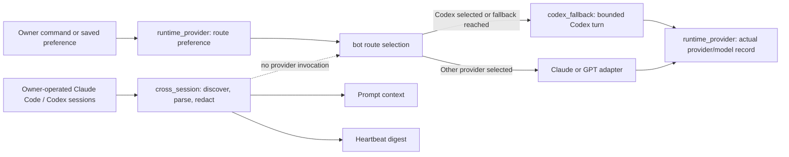

# Jarvis Architecture Decisions

This file records current decisions that are easy to blur when several Agents
work in the same area. It is current-state knowledge, not a history of every
implementation discussion. Product history remains in `docs/prd_portfolio.md`;
runtime topology and domain boundaries remain in `ARCHITECTURE.md`.

## ADR-001: Runtime Choice, Codex Execution, and Cross-Session Context

**Status:** accepted
**Decision:** executor choice, executor implementation, and external-session
continuity are three different responsibilities.

| Module | Owns | Must not own |
|---|---|---|
| `core.runtime_provider` | The owner's per-conversation preferred executor and the durable record of which provider/model actually answered. | Starting a model process, reading provider transcripts, or discovering interactive coding sessions. |
| `core.codex_fallback` | One bounded, owner-private Codex CLI execution; process control; and one durable Codex thread per Lark conversation. | Provider preference, group/untrusted traffic, or cross-session discovery and projection. |
| `core.cross_session` | Bounded discovery, parsing, redaction, and projection of owner-operated Claude Code/Codex sessions into immediate prompt context and the heartbeat digest. | Selecting or invoking a provider, claiming that an external session completed work, or replacing provider transcripts as source of truth. |

The short version is:

```text
runtime_provider chooses and records
codex_fallback executes one allowed Codex turn
cross_session observes and projects external interactive context
```

### Control Flow



### Change Routing

- Change “prefer Codex / prefer Claude”, route order, or `/model` truth in
  `core.runtime_provider` and the caller that applies that preference.
- Change Codex CLI arguments, timeout/process behavior, sandboxing, or durable
  Lark-to-Codex thread reuse in `core.codex_fallback`.
- Change which external sessions are found, excluded, redacted, parsed, or
  projected in `core.cross_session`.
- A model response is never completion evidence. Cross-session context may
  help reconstruct intent, but authoritative receipts and domain state still
  decide whether work finished.

### Dependency Rule

`cross_session` must not call `codex_fallback`, and `codex_fallback` must not
consult cross-session projections to decide whether to run. Route selection may
call the execution adapter and then record the actual result, but neither
execution nor continuity may create a second preference store.

## Architecture Adjacency Check

Use the stdlib-only graph check before and after a broad self-improve round:

```bash
python3 scripts/import_graph.py core --threshold 20
python3 scripts/import_graph.py core --format mermaid --focus core.cross_session
```

The first command ranks modules by unique adjacent internal modules and warns
when a module exceeds the chosen review threshold. The second emits a Mermaid
one-hop view suitable for a PR or architecture note. A threshold is a review
trigger, not proof that a module is badly designed; central authority modules
can have intentionally high fan-in. CI can opt into a hard gate with
`--fail-on-threshold` once a reviewed baseline exists.

The current delivery retry and cap decision is documented, with its state
machine, in `docs/delivery_retry_and_caps.md`.
