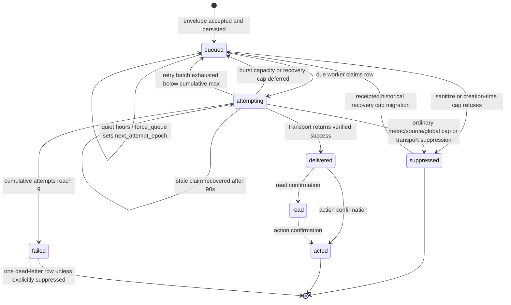
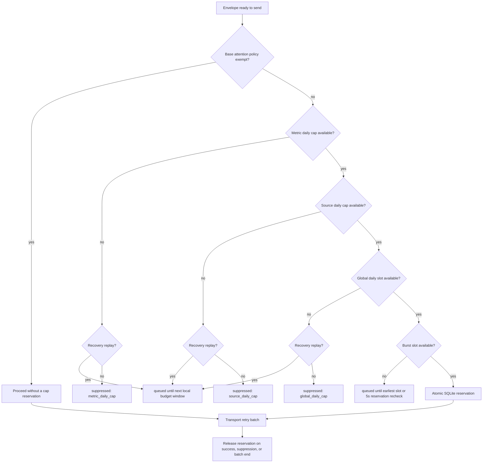

# Delivery Retry and Capacity State Machine

**Status:** current-state architecture reference
**Runtime authority:** `core.delivery`

This document freezes the interaction between envelope state, transport retry,
and proactive-attention capacity. It is a change-review aid, not a second
configuration source: constants, environment overrides, and durable state in
`core.delivery` remain authoritative.

## Envelope State Machine

`attempting` is a claim state, not a success claim. A worker may reclaim it
only after `ATTEMPT_STALE_SECONDS` (90 seconds). Each worker claim spends at
most the remaining prefix of `RETRY_DELAYS = (0, 2, 5)`. When that local batch
fails below the cumulative maximum, the envelope returns to `queued` for five
minutes. Attempt count is cumulative across workers; reaching
`MAX_DELIVERY_ATTEMPTS = 9` is terminal `failed`.

## Capacity Decision Order

Capacity is checked twice for different reasons. Creation-time checks prevent
one producer from flooding accepted work. Send-time reservations prevent
concurrent workers and quiet-hour carry-over from exceeding real delivery
capacity.

### Default Limits

| Layer | Default | Outcome when full | Scope |
|---|---:|---|---|
| metric daily | `metadata.metric_daily_cap`, normally 1 | `suppressed` | one `throttle_key` |
| source daily | 24 | `suppressed` | one producer source |
| global daily | 9 | ordinary work `suppressed`; recovery replay deferred | non-exempt proactive deliveries |
| burst | 4 per 10 minutes | `queued` until capacity is available | non-exempt proactive deliveries |
| transport retry | delays 0s, 2s, 5s | queue after a batch; fail at 9 cumulative attempts | one delivery envelope |

Source, global, burst, and burst-window defaults can be overridden by their
`JARVIS_DELIVERY_*` environment variables or envelope metadata. Metric, source,
and global exhaustion are permanent policy suppression for an ordinary
accepted envelope. A receipted recovery replay is instead deferred to the next
local budget window and revalidated against its TTL before transport. Burst
exhaustion is always a temporary capacity deferral.

`bypass_throttle`, replies, alerts, urgent work, conversation-bound work, and
deploy smoke bypass every proactive-attention cap. A recovery receipt does not
add a new exemption; it preserves the envelope's base attention class.

### Reservation Invariants

- The send-time slot is acquired under `BEGIN IMMEDIATE`; concurrent workers
  cannot both claim the final capacity slot.
- Delivered rows and live reservations are counted together.
- Reservations older than the attempting-stale timeout are removed before a
  new reservation is evaluated.
- Network I/O never runs while the reservation transaction is open.
- A reply is never stranded behind a proactive-card budget.
- The recovery marker never bypasses a cap; only an envelope carrying the
  complete recovery receipt and deferral marker may wait for the next budget
  window when its base attention class is not already exempt.
- Producers must not add their own retry or cap loop around `core.delivery`.

## Review Checklist Before Changing a Number

1. Check creation-time and send-time behavior; they intentionally differ.
2. Check exempt traffic so an attention budget cannot block a direct reply or
   alert.
3. Check concurrent final-slot reservation and stale-claim recovery.
4. Check quiet-hours work crossing midnight.
5. Check cumulative attempt accounting across more than one flush worker.
6. Run `tests/test_delivery_pipeline.py`,
   `tests/test_delivery_and_quiet_hours.py`, and
   `tests/test_reply_delivery.py` before the full suite.
